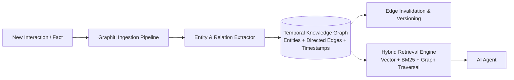

# Graphiti and Zep

Graphiti is an open-source temporal knowledge graph engine designed specifically for building dynamic, persistent memory for AI agents, while Zep is a managed enterprise platform built on top of Graphiti. Graphiti addresses the limitation of traditional RAG and static knowledge graphs by continuously tracking entities, relationships, and facts as they change over time, automatically invalidating stale facts while preserving historical context.



## Key Characteristics

- **Temporal Edge Modeling**: Facts in Graphiti are modeled as directed edges between entity nodes with `valid_at`, `invalid_at`, and timestamp metadata. When a user changes their preference (e.g. "I switched from Python to Rust"), Graphiti marks the prior edge invalid without deleting the historical fact.
- **Bi-Temporal Tracking**: Distinguishes between when an event occurred in the real world and when the system learned about it.
- **Hybrid Retrieval**: Combines semantic vector similarity, full-text BM25 search, and multi-hop graph traversal to resolve complex entity queries.
- **Open-Source Core & Cloud Engine**:
  - **Graphiti (OSS)**: Fully self-hostable Python library with backends for Neo4j, FalkorDB, and Amazon Neptune.
  - **Zep (Managed)**: Cloud platform offering low-latency memory APIs, user session management, and framework integrations for production applications.

## Python Quickstart

```python
import asyncio
from graphiti_core import Graphiti
from graphiti_core.nodes import EntityNode

async def main():
    # Initialize Graphiti connected to a graph database
    graphiti = Graphiti("neo4j://localhost:7687", auth=("neo4j", "password"))

    # Ingest conversational episode
    await graphiti.add_episode(
        name="Meeting with Bob",
        episode_body="Bob announced that Project Titan is moving from AWS to GCP starting in September.",
        source_description="Slack conversation"
    )

    # Search the temporal graph
    results = await graphiti.search("Where is Project Titan hosted?")
    for edge in results:
        print(f"{edge.source.name} -> {edge.name} -> {edge.target.name} (Valid: {edge.valid_at})")

if __name__ == "__main__":
    asyncio.run(main())
```

## Framework Integrations

Graphiti and Zep natively integrate with popular agent orchestration frameworks:

- **LangChain / LangGraph**: Provides state stores and memory providers for LangGraph graphs.
- **CrewAI & AutoGen**: Pluggable agent memory layers for multi-agent collaboration.
- **LlamaIndex**: Graph index store for temporal querying.

## Related Concepts

- [[memory]] - Foundational agent memory concepts and taxonomy.
- [[cognee]] - Topological knowledge graph memory engine.
- [[hipporag]] - Graph memory using Personalized PageRank.
- [[letta]] - Stateful agent framework with hierarchical memory.
