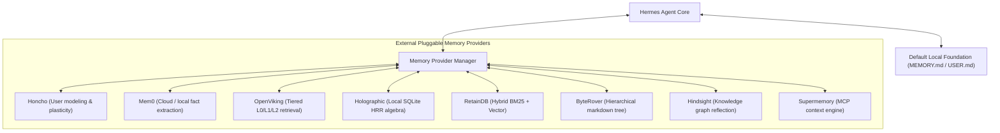

# Hermes Agent Memory Providers

Hermes Agent Memory Providers is a pluggable memory subsystem within Nous Research's autonomous Hermes Agent framework. While Hermes Agent includes a built-in file-based memory foundation (utilizing local `MEMORY.md` and `USER.md` markdown files), the memory provider interface enables users to attach specialized external memory engines for structured context capture, multi-hop recall, and cross-session knowledge synchronization.



## How Hermes Memory Providers Work

External memory providers in Hermes Agent operate alongside (rather than replacing) the built-in foundation:
1. **Pre-Turn Context Injection**: Before each agent turn, the active provider prefetches relevant memories based on the user's latest message and injects them into the system prompt context.
2. **Post-Turn Synchronization**: After the agent responds or executes tools, the provider synchronizes conversation turns and extracts new facts asynchronously.
3. **Agent Memory Tools**: Provides the agent with specialized tools to search, update, or clear stored memories.

---

## Supported Providers Breakdown

| Provider | Storage Architecture | Local / Open Source | Unique Strengths |
| :--- | :--- | :--- | :--- |
| **[[honcho]]** | Relational / Dynamic User Graph | Yes (Local Docker / SaaS) | AI-native user modeling, dialectic reasoning, and theory-of-mind plasticity. |
| **[[mem0]]** | Vector + Structured Fact Layer | Yes (Local / Cloud) | Automated fact extraction, deduplication, and user/agent/session scoping. |
| **OpenViking** | Tiered Context Storage | Yes (Self-hosted) | Multi-tier L0/L1/L2 loading designed to reduce context token usage by 80–90%. |
| **Holographic** | Local SQLite Embedded DB | Yes (Local embedded) | Uses Holographic Reduced Representations (HRR) vector-symbolic algebra with zero cloud dependencies. |
| **RetainDB** | Hybrid Database Index | Cloud / Self-hosted | Multi-modal hybrid search combining dense vectors, BM25 keyword matching, and rerankers. |
| **ByteRover** | Markdown Knowledge Tree | Yes (Local / Cloud) | Hierarchical knowledge tree stored in human-readable Markdown with tiered retrieval pipelines. |
| **Hindsight** | Reflective Knowledge Graph | Local / Cloud | Extracts discrete entity facts and performs multi-hop reflective reasoning over conversational history. |
| **[[supermemory]]** | Knowledge Graph + MCP Connectors | Yes (Local / Cloud) | Universal context engine connecting bookmarks, documents, and external apps. |

---

## Configuration & Usage

Hermes Agent allows selecting and switching memory providers via CLI or YAML configuration:

### Interactive Setup
```bash
hermes memory setup
```

### Check Memory Status
```bash
hermes memory status
```

### Manual Configuration (`~/.hermes/config.yaml`)
```yaml
memory:
  provider: "honcho" # Options: honcho, mem0, openviking, holographic, retaindb, byterover, hindsight, supermemory
  sync_enabled: true
  prefetch_limit: 5
```

## Related Concepts

- [[memory]] - Foundational agent memory concepts and cognitive taxonomy.
- [[honcho]] - Dynamic user modeling and plasticity engine.
- [[mem0]] - Vector-first memory layer.
- [[supermemory]] - Context engine and second brain.
- [[cmem]] - Persistent memory stream for coding agents.
