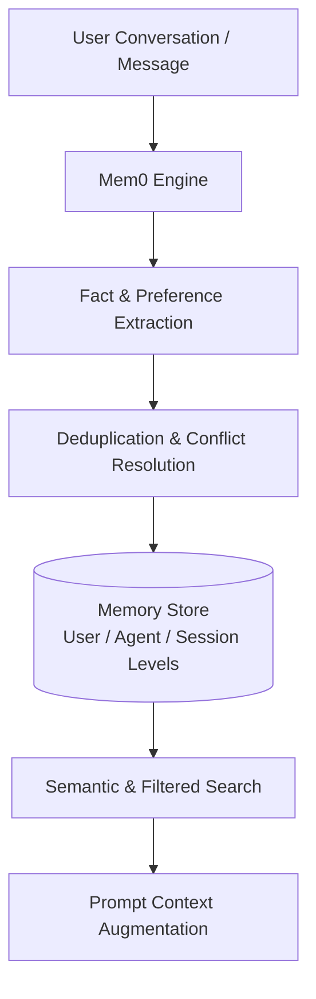

# Mem0

Mem0 (formerly Embedchain) is an open-source intelligent memory layer designed to provide personalized, persistent long-term memory for AI agents, assistants, and applications. It continuously extracts, refines, and deduplicates user preferences, session history, and agent state across conversations, enabling models to adapt dynamically to individual users over time.



## Key Characteristics

- **Multi-Level Memory Hierarchy**: Separates memory scoping into:
  - **User Level**: Long-term preferences, habits, and personal facts that persist across all conversations.
  - **Agent Level**: Agent persona, instructions, and learned execution patterns.
  - **Session / Run Level**: Short-to-medium term context bounded by a specific task or conversation thread.
- **Adaptive Fact Extraction**: Uses background LLM reasoning to detect new facts, resolve contradictions with prior memories, and update existing entries rather than appending duplicate chunks.
- **Open Source & Local Execution**: Can run as an in-process Python/TypeScript library with local vector stores (ChromaDB, Qdrant, SQLite) or via a self-hosted Docker server with a REST API.
- **Managed Cloud Offering**: Mem0 also offers a hosted SaaS platform for enterprise deployments with multi-tenancy and telemetry.

## Python Quickstart

Mem0 can be installed via `pip install mem0ai`:

```python
from mem0 import Memory

# 1. Initialize local memory instance
config = {
    "vector_store": {
        "provider": "qdrant",
        "config": {"path": "/tmp/qdrant"}
    }
}
memory = Memory.from_config(config)

# 2. Add memories from conversation turns
memory.add(
    "I prefer working with Python and async/await over synchronous code.",
    user_id="user_123",
    metadata={"category": "coding_preferences"}
)

# 3. Retrieve relevant memories during a new conversation
relevant = memory.search(
    "How should I structure the backend service?",
    user_id="user_123"
)
for entry in relevant:
    print(f"Recalled: {entry['memory']}")
```

## Supported Vector Stores

Mem0 supports a pluggable vector database architecture:

- **Local / Embedded**: Qdrant (local), ChromaDB, LanceDB, SQLite.
- **Cloud / Distributed**: Qdrant Cloud, Pinecone, Milvus, PostgreSQL (`pgvector`), Redis, OpenSearch.

## Related Concepts

- [[memory]] - Foundational agent memory concepts and taxonomy.
- [[supermemory]] - Context engine and second-brain platform with MCP support.
- [[langmem]] - LangChain SDK for semantic and episodic memory management.
- [[cmem]] - Persistent memory layer optimized for coding workflows.
