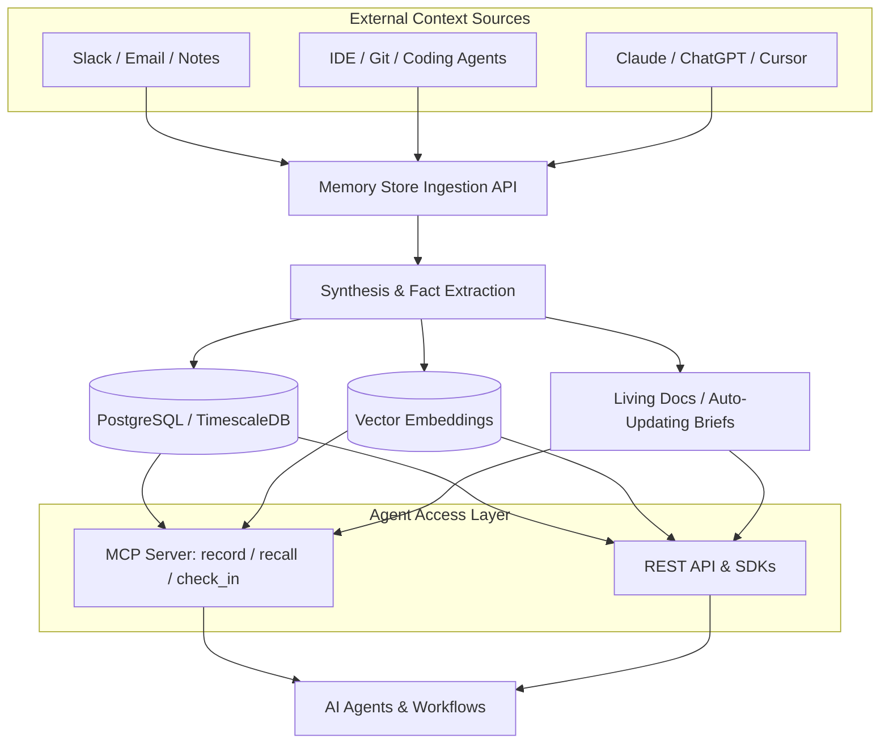

# Memory Store (Julep)

Memory Store (`memory.store`) is an AI-native persistent memory layer and "company brain" built by the creators of Julep AI. It captures decisions, facts, and context across fragmented tools (such as Slack, Gmail, IDEs, Claude, and ChatGPT) and synthesizes them into structured, auto-updating knowledge accessible by AI agents through the Model Context Protocol (MCP) and REST APIs.



## Key Characteristics

- **Cross-Tool Living Memory**: Gathers insights across team tools and IDE sessions, allowing agents to retain context without dumping entire message logs into prompts.
- **Model Context Protocol (MCP) Integration**: Native MCP server providing core memory tools (`record`, `recall`, `check_in`), making it instantly compatible with MCP-compliant clients like Claude Code, Cursor, and custom agent harnesses.
- **Auto-Updating "Briefs"**: Generates self-maintaining documentation and decision logs that evolve dynamically as new interactions occur.
- **Open-Source Infrastructure**: Built on top of the open-source Julep agent workflow engine (utilizing PostgreSQL, TimescaleDB, and `pgvector` for state persistence).

## MCP Tools Interface

When integrated into an MCP client, Memory Store exposes three fundamental cognitive primitives:

| Tool       | Purpose                                                  | Example Use                                                       |
| :--------- | :------------------------------------------------------- | :---------------------------------------------------------------- |
| `record`   | Stores a discrete decision, user preference, or fact.    | Recording an architectural choice or database schema constraint.  |
| `recall`   | Queries memory using semantic search and entity filters. | Looking up prior conventions or decisions before generating code. |
| `check_in` | Syncs current session status, tasks, and progress.       | Saving checkpoint state when wrapping up a development turn.      |

## Quickstart via MCP Configuration

To configure Memory Store in an MCP client configuration (such as `claude_desktop_config.json`):

```json
{
  "mcpServers": {
    "memory-store": {
      "command": "npx",
      "args": ["-y", "@julep/memory-store-mcp"],
      "env": {
        "MEMORY_STORE_API_KEY": "your-api-key"
      }
    }
  }
}
```

## Related Concepts

- [[memory]] - Foundational agent memory concepts and taxonomy.
- [[cmem]] - Persistent memory stream for coding agents.
- [[supermemory]] - Second brain and context engine with MCP.
- [[honcho]] - User modeling and plasticity memory platform.
