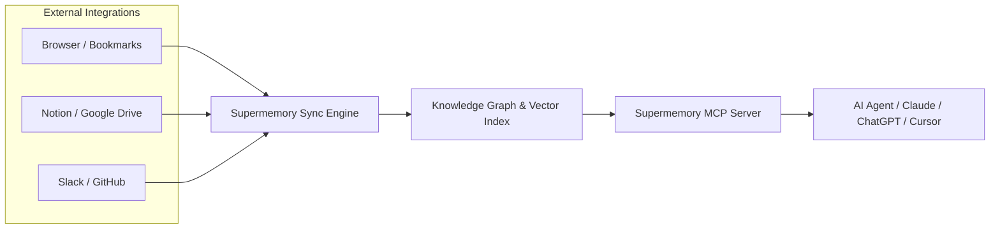

# Supermemory

Supermemory is an open-source "second brain" and memory engine designed to provide AI agents and human users with persistent context across applications. It connects diverse information sources (such as bookmarks, browser history, Google Drive, Notion, Slack, and GitHub) and synthesizes them into an intelligent context layer accessible via the Model Context Protocol (MCP), REST APIs, and client extensions.



## Key Characteristics

- **Multi-Source Connectors**: Automatically ingests and indexes bookmarks, web pages, notes, and documents into a unified semantic space.
- **Model Context Protocol (MCP) Support**: Offers a native MCP server, enabling local and cloud LLM tools (Claude Desktop, Cursor, OpenClaw) to query user memory seamlessly.
- **Hybrid Retrieval Engine**: Combines knowledge graph relationships, user profile attributes, and dense vector search for fast, relevant context retrieval.
- **Local & Self-Hostable**: The complete Supermemory stack is open source (TypeScript/Next.js/Postgres) and can be deployed locally using Docker or self-hosted servers.

## Quickstart via MCP

Configure Supermemory in your MCP client settings:

```json
{
  "mcpServers": {
    "supermemory": {
      "command": "npx",
      "args": ["-y", "@supermemory/mcp-server"],
      "env": {
        "SUPERMEMORY_API_KEY": "your-api-key"
      }
    }
  }
}
```

## Related Concepts

- [[memory]] - Foundational agent memory concepts and taxonomy.
- [[memory-store]] - Multi-tool cognitive memory platform with MCP support.
- [[mem0]] - Vector-first persistent memory layer.
- [[cmem]] - Persistent memory stream for coding workflows.
