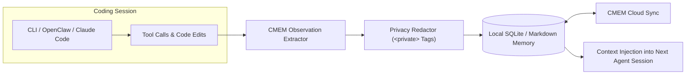

# Claude-Mem (cmem.ai)

Claude-Mem (`cmem.ai`) is an open-source persistent memory system and context stream designed specifically for terminal coding agents and AI workflows, such as Claude Code, OpenClaw, and cursor-based environments. It captures tool executions, user decisions, file edits, and architectural constraints across development sessions, compressing and injecting relevant memories back into future agent turns.



## Key Characteristics

- **Agent Workflow Continuity**: Eliminates the "cold start" penalty across development sessions by recording project conventions, debugging steps, and dependency decisions.
- **Privacy Controls**: Supports `<private>` markup tags in prompts and files to explicitly omit credentials, tokens, or sensitive context from persistent memory storage.
- **Two-Tier Architecture (Local + Cloud)**:
  - **Local Mode (OSS)**: Operates completely offline with local SQLite storage, zero external data leaks, and local embedding support.
  - **CMEM Cloud (`cmem.ai`)**: Multi-device real-time sync, web viewer dashboard for memory stream inspection, and private Model Context Protocol (MCP) server endpoints.
- **Native OpenClaw & Claude Code Support**: Provides ready-to-run installation scripts (`openclaw.sh`, `npx claude-mem install`) and hook integrations for terminal agent frameworks.

## Installation & Setup

Install locally via `npx`:

```bash
npx claude-mem install
```

Or configure via OpenClaw plugin:

```bash
curl -fsSL https://cmem.ai/openclaw.sh | bash
```

## CLI Usage & Commands

Claude-Mem exposes simple commands to view, search, and manage stored context:

```bash
# Check memory health and stored record count
cmem status

# Search memory for past architectural decisions
cmem search "authentication architecture"

# Manually record a project rule or preference
cmem remember "Always run nix-shell before executing python tests"
```

## Related Concepts

- [LLM and Agent Memory](memory.md) - Overview of AI agent memory architectures.
- [Memory Store (Julep)](memory-store.md) - Multi-tool cognitive memory platform with MCP support.
- [Mem0](mem0.md) - Vector-first memory layer for assistants.
- [Hermes Agent Memory Providers](hermes-memory-providers.md) - Pluggable memory backends in Hermes Agent.
