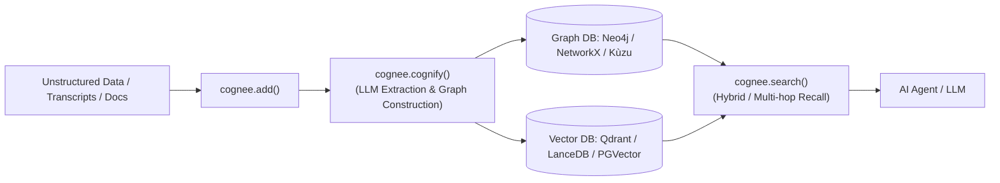

# Cognee

Cognee is an open-source memory engine for AI applications and agents that organizes data into interconnected, topological knowledge graphs and vector embeddings. It bridges the gap between unstructured data ingestion and high-precision retrieval by transforming documents, conversations, and code into structured relational graphs enriched with semantic vectors.



## Key Characteristics

- **Topological Knowledge Graphs**: Transforms raw inputs into nodes and edges representing entities and relations, enabling multi-hop associative queries that pure vector similarity searches miss.
- **Local & Self-Hostable**: Can run completely locally using embedded engines like SQLite, NetworkX, and LanceDB, or scale to production using Neo4j, Qdrant, and PostgreSQL (`pgvector`).
- **Deterministic Pipeline**: Provides explicit control over data ingestion (`add`), graph cognition (`cognify`), and semantic/graph querying (`search`).
- **Multi-Modal Support**: Processes PDFs, audio files, GitHub repositories, and tabular data into uniform cognitive graphs.

## Core API Workflow

Cognee exposes a Python API structured around three main operations:

```python
import asyncio
import cognee

async def main():
    # 1. Add raw text, files, or datasets to the memory pipeline
    await cognee.add("Alice is the lead architect for the Orion project based in Zurich.")
    await cognee.add("The Orion project uses Rust and Apache Arrow for memory efficiency.")

    # 2. Cognify: Extract entities, resolve relationships, and construct graph embeddings
    await cognee.cognify()

    # 3. Search: Retrieve structured memory context
    results = await cognee.search("What technologies does Alice's project rely on?")
    for result in results:
        print(result)

if __name__ == "__main__":
    asyncio.run(main())
```

## Supported Storage Backends

| Component | Embedded / Local | Production / Distributed |
| :--- | :--- | :--- |
| **Relational DB** | SQLite | PostgreSQL |
| **Graph DB** | NetworkX, Kùzu | Neo4j, FalkorDB |
| **Vector DB** | LanceDB, ChromaDB | Qdrant, Milvus, pgvector |

## Related Concepts

- [LLM and Agent Memory](memory.md) - Overview of AI agent memory architectures.
- [Graphiti and Zep](graphiti.md) - Temporal knowledge graph engine for dynamic conversational memory.
- [HippoRAG](hipporag.md) - Neurobiologically inspired knowledge graph retrieval with PageRank.
