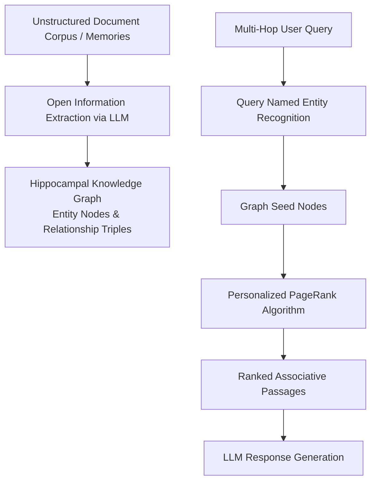

# HippoRAG

HippoRAG is an open-source retrieval and long-term memory framework developed by the Ohio State University NLP Group. Inspired by the hippocampal indexing theory of human memory, HippoRAG enables Large Language Models (LLMs) to perform complex, multi-hop associative recall across knowledge corpora in a single retrieval step using knowledge graphs and Personalized PageRank (PPR).



## Neurobiological Inspiration

Traditional RAG systems mimic the neocortex by relying on dense vector embeddings for semantic similarity, which struggle with multi-hop associative reasoning without slow, iterative multi-turn retrieval loops.

HippoRAG models human brain architecture:
- **Neocortex (LLMs & Embeddings)**: Extracts structured triples and forms representations.
- **Hippocampus (Personalized PageRank & Graph Index)**: Acts as an indexing engine connecting distinct entities across disparate documents, allowing pattern separation and associative pattern completion in a single algorithmic pass.

## Key Characteristics

- **Single-Step Multi-Hop Retrieval**: Discovers associative connections spanning multiple documents without iterative retrieval latency.
- **High Efficiency**: Significantly cheaper and faster at indexing and querying compared to iterative GraphRAG or iterative agentic search workflows.
- **Continual Learning**: Accommodates incremental updates to the knowledge graph without requiring retraining or full corpus re-embedding.
- **Open Source & Local**: Published under the MIT license, available via PyPI (`pip install hipporag`), and fully runnable on local hardware using local LLMs (e.g., via vLLM or Ollama).

## Python Quickstart

```python
from hipporag import HippoRAG

# 1. Initialize HippoRAG instance
hipporag = HippoRAG(
    llm_model="meta-llama/Llama-3.3-70B-Instruct",
    embedding_model="nvidia/NV-Embed-v2"
)

# 2. Index corpus of documents or agent memories
documents = [
    "Alice founded Quantum Dynamics in 2022 in Geneva.",
    "Quantum Dynamics specializes in topological quantum computing chips.",
    "The Swiss National Science Foundation awarded Geneva-based quantum startups 10M CHF."
]
hipporag.index(documents)

# 3. Perform associative multi-hop retrieval
query = "What funding did Alice's research domain receive in Switzerland?"
results = hipporag.retrieve(query, top_k=2)
for doc in results:
    print("Retrieved context:", doc)
```

## Related Concepts

- [LLM and Agent Memory](memory.md) - Foundational agent memory concepts and cognitive taxonomy.
- [Cognee](cognee.md) - Topological knowledge graph memory engine.
- [Graphiti and Zep](graphiti.md) - Temporal knowledge graph engine for dynamic agent memory.
