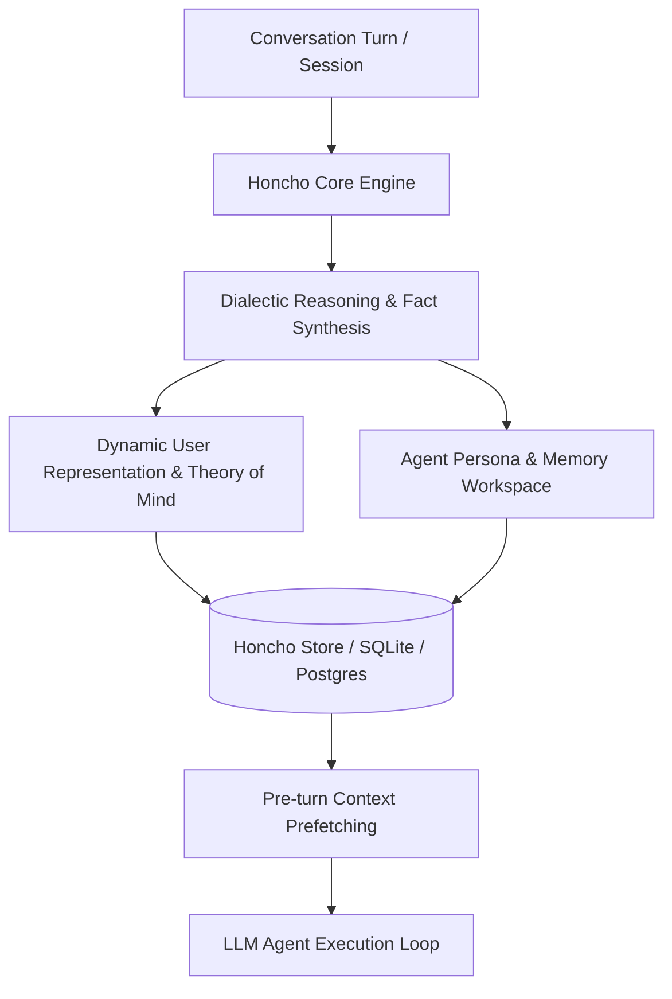

# Honcho

Honcho is an open-source, AI-native memory and user-modeling platform created by Plastic Labs. Unlike standard vector databases that perform simple semantic chunk matching, Honcho focuses on "natural language plasticity" and dialectic reasoning—building evolving, high-fidelity representations of user and agent identities, psychological traits, and cognitive state over long time horizons.



## Key Characteristics

- **Dialectic Reasoning & User Modeling**: Synthesizes nuanced user profiles, working hypotheses, and communication styles rather than storing raw text strings.
- **Natural Language Plasticity**: Dynamically refines and consolidates context across multiple sessions, allowing the agent to continuously adapt without bloating token budgets.
- **Hermes Agent & OpenClaw Integration**: Supported natively as an external memory provider in autonomous agent runtimes like [Hermes Agent Memory Providers](hermes-memory-providers.md) and Claude Code setups.
- **Self-Hostable & Managed SaaS**:
  - **Open Source**: The core Honcho server and Python SDK (`plastic-labs/honcho`) can be run locally using Docker and relational databases.
  - **Honcho Cloud (`api.honcho.dev`)**: Hosted multi-tenant platform for production agent deployments.

## Integration Architecture

Honcho operates on a session and workspace model:

```python
from honcho import Honcho

# 1. Initialize Honcho client (local or cloud)
client = Honcho(base_url="http://localhost:8000")

# 2. Register user session and message turns
session = client.sessions.get_or_create(session_id="session_01", user_id="user_alice")
session.add_message(role="user", content="I am building a high-throughput telemetry agent in Go.")

# 3. Query peer representation and context
context = session.get_context(query="What programming language is Alice focusing on?")
print("Prefetched context:", context)
```

## Related Concepts

- [LLM and Agent Memory](memory.md) - Foundational agent memory concepts and cognitive taxonomy.
- [Hermes Agent Memory Providers](hermes-memory-providers.md) - Overview of memory providers in Hermes Agent.
- [Letta](letta.md) - Stateful agent framework with self-editing core memory.
- [Mem0](mem0.md) - Personalized memory layer with multi-level scoping.
