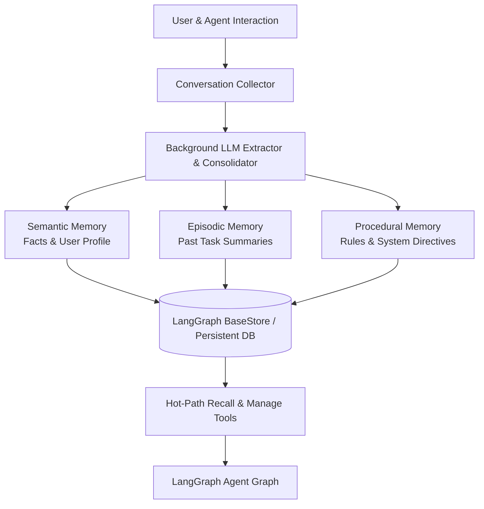

# LangMem

LangMem is an open-source Python SDK developed by LangChain to provide AI agents and LangGraph workflows with long-term memory. It allows agents to learn, adapt, and maintain behavioral consistency across sessions by automatically extracting, storing, and consolidating semantic facts, episodic interaction summaries, and procedural execution patterns.



## Cognitive Memory Primitives

LangMem structures agent memory into three primary operational categories:

1. **Semantic Memory (User & World Knowledge)**:
   - Maintains continuous profiles of users, preferences, and factual constraints.
   - Updates dynamically as conversations progress, combining new information with prior records.
2. **Episodic Memory (Past Experiences)**:
   - Summarizes and indexes completed threads, debugging sessions, and tasks.
   - Allows agents to recall how past problems were solved or past decisions were justified.
3. **Procedural Memory (Behavioral & Prompt Adaptation)**:
   - Automatically refines system prompts, instructions, and behavioral guidelines based on feedback or error corrections.

## Key Characteristics

- **LangGraph Native**: Built to leverage LangGraph's persistent state and storage primitives (`BaseStore`), running seamlessly with PostgreSQL, SQLite, or in-memory stores.
- **Background & Hot-Path Modes**: Supports both real-time "hot path" memory tool invocations by the agent and asynchronous background memory extraction routines that run after a conversation completes.
- **Pluggable & Model Agnostic**: Works with any LLM provider (OpenAI, Anthropic, Gemini, Ollama) and custom embedding models.
- **Open Source**: Licensed permissively under MIT and fully runnable locally without external SaaS dependencies.

## Python Quickstart

Install LangMem:

```bash
pip install -U langmem
```

Example usage extracting and retrieving user facts:

```python
from langmem import create_memory_store, create_memory_manager

# 1. Create a memory store instance
store = create_memory_store()

# 2. Create memory manager configured for semantic extraction
manager = create_memory_manager(
    "anthropic:claude-3-5-sonnet-latest",
    store=store,
    namespace=("users", "user_42", "memories")
)

# 3. Process conversation turns and extract facts
conversation = [
    {"role": "user", "content": "I live in Berlin and always test using pytest."},
    {"role": "assistant", "content": "Understood! I'll use pytest for your tests."}
]
manager.invoke(conversation)

# 4. Search extracted memories
memories = store.search(("users", "user_42", "memories"), query="testing framework")
for mem in memories:
    print(mem.value)
```

## Related Concepts

- [LLM and Agent Memory](memory.md) - Foundational agent memory concepts and cognitive taxonomy.
- [Mem0](mem0.md) - Vector-first persistent memory layer.
- [Letta](letta.md) - Stateful agent framework with hierarchical memory.
- [Graphiti and Zep](graphiti.md) - Temporal knowledge graph engine for agent memory.
