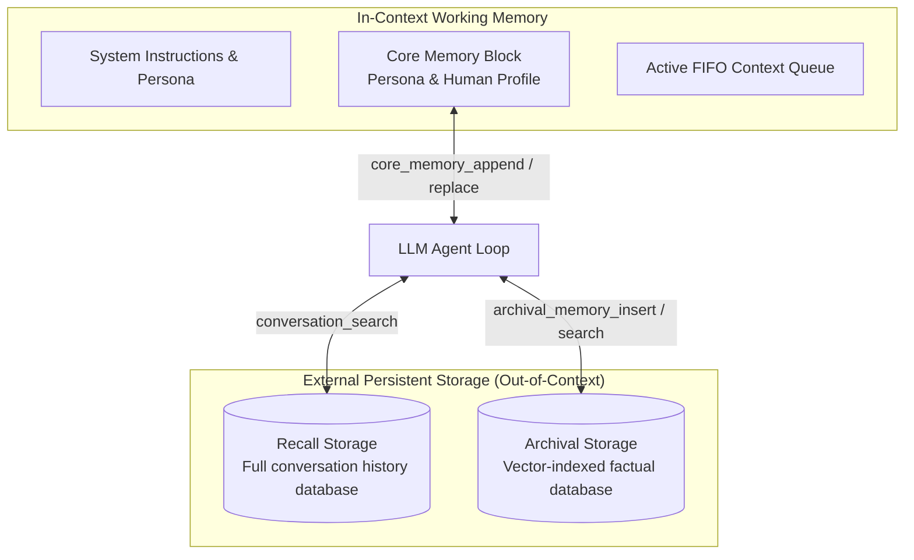

# Letta

Letta (formerly MemGPT) is an open-source framework and runtime for building stateful AI agents with persistent, self-editing memory. Drawing inspiration from traditional operating system memory hierarchies, Letta enables LLMs to function as operating systems that manage their own context windows through virtual memory paging, tool calls, and archival search.



## The OS Memory Paradigm

Standard LLMs face a fundamental tradeoff: they are limited by context window sizes and forget everything once a session closes. Letta resolves this via a multi-tiered memory architecture:

1. **Core Memory (In-Context)**:
   - Always present in the LLM's active prompt.
   - Structured into editable blocks: **Persona** (the agent's identity and directives) and **Human** (key facts, relationship history, and instructions about the user).
   - The agent edits this block directly via memory tool calls (`core_memory_append`, `core_memory_replace`).
2. **Recall Storage (Out-of-Context)**:
   - An append-only relational database of the complete conversation history.
   - The agent can search past conversations by time range or keywords (`conversation_search`).
3. **Archival Storage (Out-of-Context)**:
   - A vector-indexed knowledge repository for arbitrary text chunks, documents, and distilled knowledge.
   - The agent can insert new entries (`archival_memory_insert`) and perform semantic searches (`archival_memory_search`).

## Key Characteristics

- **Self-Editing State**: The agent explicitly decides what to remember, modify, or page out of working context based on conversation developments.
- **Multi-Agent & Multi-User Runtime**: Provides a multi-tenant agent server with REST APIs, WebSocket support, and user isolation.
- **Local & Self-Hostable**: The complete Letta server runs locally via Docker or Python with SQLite/PostgreSQL and local embedding models (Ollama, vLLM).
- **Desktop UI & CLI**: Includes developer tools like `letta-code`, an interactive CLI, and an open-source desktop interface (`letta-oss-ui`).

## CLI Quickstart

Install the Letta CLI:

```bash
npm i -g @letta-ai/letta-code
```

Start the Letta server and run a persistent agent:

```bash
letta run
```

## Related Concepts

- [LLM and Agent Memory](memory.md) - Foundational agent memory concepts and cognitive taxonomy.
- [Mem0](mem0.md) - Vector-first intelligent memory layer.
- [Honcho](honcho.md) - User-modeling and dialectic reasoning engine.
- [Hermes Agent Memory Providers](hermes-memory-providers.md) - Memory provider integrations for autonomous agents.
