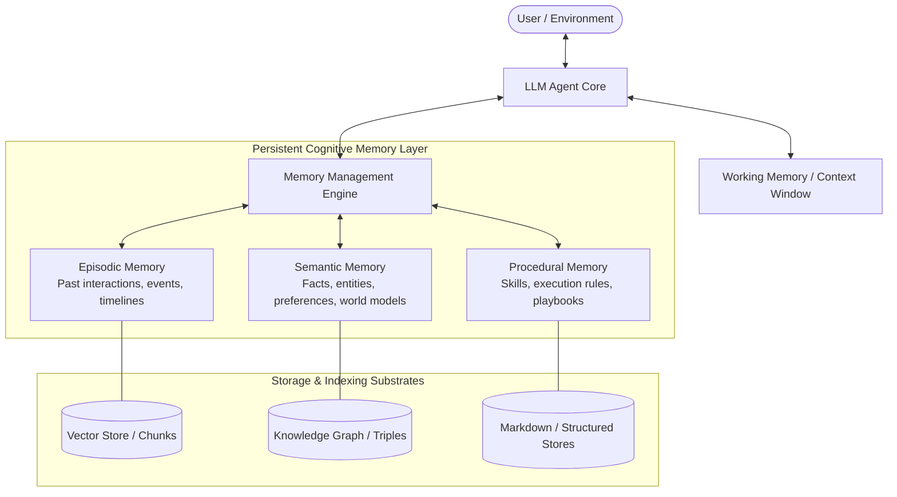

# LLM and Agent Memory

LLM and Agent Memory refers to the software architectures, data structures, and algorithms that provide Large Language Model (LLM) agents with persistent, stateful, and adaptive context across interactions and time. While standard foundation models are stateless between API calls and traditional Retrieval-Augmented Generation (RAG) focuses on static document retrieval, agent memory systems enable continuous learning, self-updating user profiles, episodic recall, and procedural skill acquisition.

## Core Cognitive Memory Taxonomy

Modern AI memory systems adopt cognitive psychology classifications to structure long-term agent state:

### 1. Working Memory (Short-Term / In-Context)

- **Definition**: The active context window of the LLM containing the immediate prompt, recent conversational turns, tool call outputs, and scratchpad reasoning.
- **Characteristics**: Fast, volatile, strictly bounded by the model's maximum context length and attention budget.

### 2. Episodic Memory (Events & Experiences)

- **Definition**: Temporal records of past events, conversations, user interactions, and multi-step task executions ("what happened, when, and how").
- **Characteristics**: Time-stamped, append-heavy, often compressed or summarized periodically to preserve long-range experiential history.

### 3. Semantic Memory (Facts & Knowledge)

- **Definition**: Discrete, factual knowledge about users, organizations, codebases, and domain concepts ("what is true").
- **Characteristics**: Extracted and synthesized from episodic events; subject to continuous updating, deduplication, and contradiction resolution.

### 4. Procedural Memory (Skills & Rules)

- **Definition**: How-to knowledge, behavioral guidelines, playbooks, prompts, and learned tool execution patterns ("how to act").
- **Characteristics**: Iteratively refined through feedback loops, error corrections, and reinforcement.

---

## Architectural Paradigms

Agent memory architectures have evolved into several distinct design patterns:

| Paradigm                            | Description                                                                                          | Representative Systems                          | Strengths                                                            | Trade-offs                                                    |
| :---------------------------------- | :--------------------------------------------------------------------------------------------------- | :---------------------------------------------- | :------------------------------------------------------------------- | :------------------------------------------------------------ |
| **Flat Markdown & File Memory**     | Memory stored in human-readable Markdown files (`MEMORY.md`, `USER.md`) with lightweight embeddings. | [Claude-Mem (cmem.ai)](cmem.md), [Hermes Agent Memory Providers](hermes-memory-providers.md), OpenClaw | Inspectable, versionable with Git, transparent.                      | Limited multi-hop relational reasoning.                       |
| **Fact-Extraction & Vector Layers** | Automated LLM extraction of atomic facts into vector databases with decay and reflection.            | [Mem0](mem0.md), [Supermemory](supermemory.md), [LangMem](langmem.md)          | Fast semantic search, automatic deduplication, easy integration.     | Weak temporal invalidation and relational joins.              |
| **LLM-as-an-OS (Virtual Paging)**   | Hierarchical memory tiers (Core, Archival, Recall) actively managed by the LLM via tool calls.       | [Letta](letta.md)                                       | Self-editing memory, explicit memory control by the agent.           | Higher LLM token overhead during paging operations.           |
| **Temporal Knowledge Graphs**       | Knowledge graphs linking entities, relationships, and temporal validities with hybrid search.        | [Graphiti and Zep](graphiti.md), [Cognee](cognee.md), [HippoRAG](hipporag.md)          | Multi-hop reasoning, temporal fact invalidation, structured context. | Graph construction latency and schema complexity.             |
| **Cognitive Databases & MCP**       | Shared memory infrastructure exposed to agents via the Model Context Protocol (MCP) or APIs.         | [Memory Store (Julep)](memory-store.md), [Honcho](honcho.md)                    | Cross-tool interoperability, team-wide context sharing.              | Requires network infrastructure and multi-agent coordination. |

---

## Memory vs. Traditional RAG

| Dimension          | Traditional RAG                                     | Agent Memory Systems                                                               |
| :----------------- | :-------------------------------------------------- | :--------------------------------------------------------------------------------- |
| **Data Flow**      | Read-only (one-way retrieval from external corpora) | Read-Write (bidirectional continuous extraction, storage, and recall)              |
| **Lifecycle**      | Static documents indexed in advance                 | Dynamic, self-improving, updated after each conversation or task turn              |
| **Focus**          | Document chunk matching via semantic similarity     | Entity relationships, user identity, temporal awareness, and behavioral adaptation |
| **Decay & Update** | Re-index entire corpus when documents change        | Incremental extraction, entity resolution, and temporal invalidation               |

---

## Key Software and Implementations

The following systems implement LLM and agent memory across open-source and cloud environments:

- [Cognee](cognee.md): Open-source topological memory engine combining knowledge graphs, vectors, and relational storage.
- [Mem0](mem0.md): Open-source personalized memory layer with multi-level context extraction and vector search.
- [Letta](letta.md): Stateful agent framework and LLM operating system featuring hierarchical self-editing memory.
- [Graphiti and Zep](graphiti.md): Open-source temporal knowledge graph engine designed for dynamic agent memory and entity tracking.
- [Claude-Mem (cmem.ai)](cmem.md): Persistent memory stream and context compressor tailored for coding agents like Claude Code and OpenClaw.
- [Memory Store (Julep)](memory-store.md): Cognitive memory platform and company brain by Julep AI with Model Context Protocol (MCP) integration.
- [LangMem](langmem.md): Long-term memory SDK by LangChain supporting semantic, episodic, and procedural memory extraction.
- [Honcho](honcho.md): User modeling and natural language plasticity memory engine by Plastic Labs.
- [Supermemory](supermemory.md): Open-source second brain and context engine connecting external data to LLMs via MCP.
- [HippoRAG](hipporag.md): Neurobiologically inspired multi-hop memory framework using Personalized PageRank on knowledge graphs.
- [Hermes Agent Memory Providers](hermes-memory-providers.md): Survey of external memory provider plugins in Hermes Agent (OpenViking, Holographic HRR, Hindsight, RetainDB, ByteRover).
